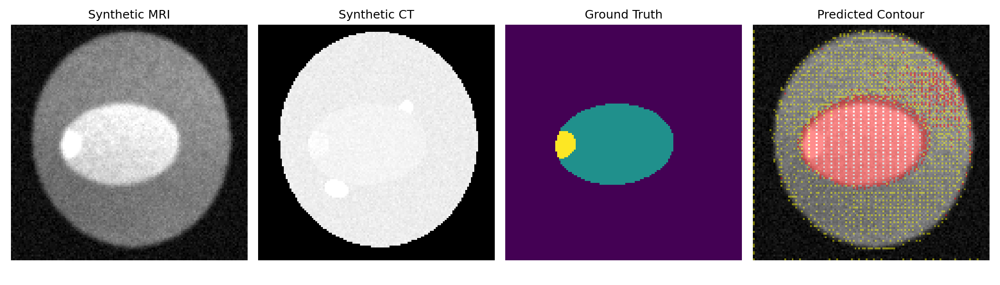
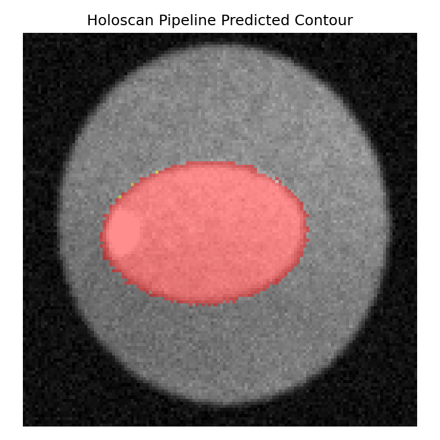
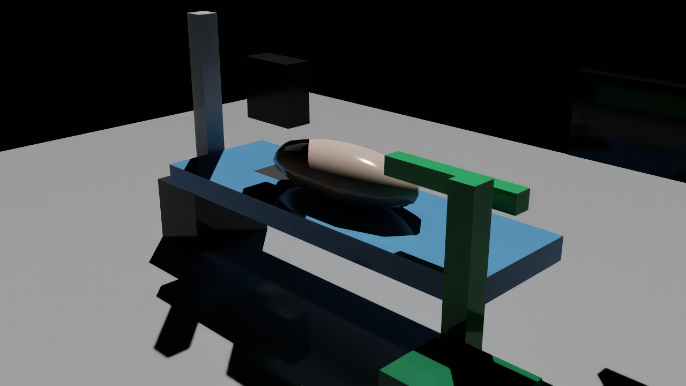
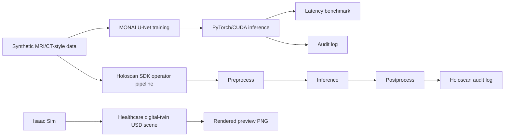

# Healthcare Physical-AI Demo using NVIDIA AI Stack

> Independent proof-of-concept showing a healthcare physical-AI workflow using MONAI, PyTorch/CUDA, Holoscan SDK, and Isaac Sim.

This project demonstrates how synthetic medical imaging data, AI-assisted contouring, edge-style inference, audit logging, and a lightweight healthcare digital-twin scene can be connected into one end-to-end workflow.

**Important disclaimer:** This is an independent educational/demo project. It is not affiliated with or endorsed by NVIDIA, GE HealthCare, or any clinical institution. It is not clinical-grade, not a medical device, and must not be used for diagnosis, treatment planning, or patient care.

---

## Recruiter / Hiring Manager TL;DR

This project was built to demonstrate hands-on fluency across the core building blocks of healthcare physical AI:

- **MONAI + PyTorch/CUDA:** synthetic MRI/CT-style data generation, toy organ/tumor auto-contouring, GPU inference benchmarking.
- **Holoscan SDK:** operator-style pipeline for edge-AI inference, preprocessing, postprocessing, and audit logging.
- **Isaac Sim:** rendered healthcare digital-twin scene representing an image-guided procedure room with patient table, patient phantom, imaging device placeholder, robotic/cart placeholder, monitor, and OR floor.
- **Responsible AI / regulated workflow patterns:** audit logs, synthetic data only, reproducible outputs, and clear separation between proof-of-concept and clinical-grade software.

---

## Visual Outputs

The images below are included so a reviewer can understand the project at a glance.

### 1. Synthetic MRI/CT + Toy Auto-Contouring Output



### 2. Holoscan Edge-AI Pipeline Output



### 3. Isaac Sim Healthcare Digital-Twin Scene



---

## End-to-End Workflow



---

## What This Project Demonstrates

### 1. Synthetic Medical Imaging Data

The project creates synthetic MRI/CT-style 2D imaging cases with paired masks. The goal is not clinical realism; the goal is to create a reproducible dataset for demonstrating AI workflow mechanics.

**Key outputs:**

- `data/synthetic_cases/`
- `outputs/summary_visualization.png`

### 2. MONAI Auto-Contouring Workflow

A small MONAI/PyTorch segmentation model is trained on synthetic organ/tumor masks. The model is intentionally lightweight so the workflow can run on CPU, Colab GPU, or cloud GPU.

**Key files:**

- `src/generate_synthetic_mri_ct.py`
- `src/train_monai_autocontour.py`
- `src/infer_edge_workflow.py`
- `src/visualize_outputs.py`

### 3. CUDA / GPU Benchmarking

The demo benchmarks inference latency on CPU and GPU to show the impact of accelerated inference for edge-AI style workflows.

**Example benchmark result from this project:**

| Environment | p95 Latency | Notes |
|---|---:|---|
| CPU | ~5.51 ms | Local CPU benchmark |
| NVIDIA T4 GPU | ~1.52 ms | PyTorch/CUDA benchmark |
| GPU Speedup | ~3.6x | GPU p95 vs CPU p95 |

**Key outputs:**

- `outputs/cpu_benchmark.json`
- `outputs/gpu_benchmark.json`
- `outputs/benchmark_summary.json`
- `outputs/cuda_environment.json`

### 4. Holoscan SDK Operator Pipeline

The Holoscan pipeline organizes the workflow into operator-style stages:

1. Data source
2. Preprocessing
3. MONAI inference
4. Postprocessing
5. Audit logging

This mirrors how a healthcare edge-AI workflow could be decomposed into modular, observable processing stages.

**Key files and outputs:**

- `src/holoscan_pipeline.py`
- `outputs/holoscan_audit_log.json`
- `outputs/holoscan_pipeline_output.png`
- `outputs/holoscan_prediction.npy`

### 5. Isaac Sim Healthcare Digital Twin

The Isaac Sim component creates a lightweight healthcare procedure-room scene in USD format and renders a PNG preview. The scene is conceptual and includes a patient table, patient phantom, imaging-device placeholder, robotic/cart placeholder, monitor, lighting, and OR floor.

**Key files and outputs:**

- `isaac/create_healthcare_or_scene.py`
- `isaac/render_usd_preview.py`
- `outputs/isaac_healthcare_or_digital_twin.usd`
- `outputs/isaac_scene_metadata.json`
- `outputs/isaac_scene_preview.png`

### 6. Audit Logging and Workflow Traceability

The project creates JSON audit logs showing model name/version, case ID, device, latency, and output paths. This is a simplified demonstration of traceability patterns relevant to regulated AI workflows.

**Key outputs:**

- `outputs/edge_audit_log.json`
- `outputs/holoscan_audit_log.json`

---

## Repository Structure

```text
.
├── README.md
├── requirements-cpu.txt
├── requirements-gpu.txt
├── requirements-holoscan.txt
├── src/
│   ├── generate_synthetic_mri_ct.py
│   ├── train_monai_autocontour.py
│   ├── infer_edge_workflow.py
│   ├── benchmark_latency.py
│   ├── visualize_outputs.py
│   └── holoscan_pipeline.py
├── isaac/
│   ├── create_healthcare_or_scene.py
│   └── render_usd_preview.py
├── outputs/
│   ├── summary_visualization.png
│   ├── edge_audit_log.json
│   ├── cpu_benchmark.json
│   ├── gpu_benchmark.json
│   ├── benchmark_summary.json
│   ├── cuda_environment.json
│   ├── holoscan_audit_log.json
│   ├── holoscan_pipeline_output.png
│   ├── holoscan_prediction.npy
│   ├── isaac_healthcare_or_digital_twin.usd
│   ├── isaac_scene_metadata.json
│   └── isaac_scene_preview.png
└── data/
    └── synthetic_cases/
```

---

## Quick Start: CPU Workflow

```bash
python -m venv .venv
source .venv/bin/activate

pip install -r requirements-cpu.txt

python src/generate_synthetic_mri_ct.py
python src/train_monai_autocontour.py
python src/infer_edge_workflow.py --case-id case_000
python src/benchmark_latency.py
python src/visualize_outputs.py
```

---

## Quick Start: GPU / CUDA Workflow

This workflow was tested on NVIDIA GPU infrastructure using PyTorch/CUDA.

```bash
pip install -r requirements-gpu.txt

python src/generate_synthetic_mri_ct.py
python src/train_monai_autocontour.py
python src/infer_edge_workflow.py --case-id case_000 --device cuda
python src/benchmark_latency.py --device cuda
python src/visualize_outputs.py
```

Check CUDA availability:

```bash
python - <<'PY'
import torch
print("CUDA available:", torch.cuda.is_available())
print("GPU:", torch.cuda.get_device_name(0) if torch.cuda.is_available() else "CPU only")
PY
```

---

## Quick Start: Holoscan SDK Pipeline

Install Holoscan dependencies in a compatible environment:

```bash
pip install -r requirements-holoscan.txt
```

Run the Holoscan operator pipeline:

```bash
python src/holoscan_pipeline.py --case-id case_000
```

Expected outputs:

```text
outputs/holoscan_audit_log.json
outputs/holoscan_pipeline_output.png
outputs/holoscan_prediction.npy
```

---

## Quick Start: Isaac Sim / RunPod Workflow

The Isaac Sim scene was generated in an Isaac Sim container environment.

Create the USD healthcare scene:

```bash
/isaac-sim/python.sh isaac/create_healthcare_or_scene.py
```

Render the scene preview:

```bash
/isaac-sim/python.sh isaac/render_usd_preview.py
```

Expected outputs:

```text
outputs/isaac_healthcare_or_digital_twin.usd
outputs/isaac_scene_metadata.json
outputs/isaac_scene_preview.png
```

---

## What This Is

This project is a practical, end-to-end demonstration of:

- Healthcare AI workflow design
- Synthetic imaging data generation
- MONAI-based segmentation
- CUDA inference benchmarking
- Holoscan-style edge-AI pipeline design
- Isaac Sim healthcare digital-twin scene creation
- Audit logging and traceability concepts

---

## What This Is Not

This project is **not**:

- A clinical-grade model
- A validated segmentation algorithm
- A diagnostic or treatment-planning tool
- An FDA-cleared or regulated medical device
- An official NVIDIA project
- A substitute for clinical validation, cybersecurity review, quality-system controls, or regulatory approval

---

## License

Use an open-source license appropriate for your repository. Recommended options:

- MIT License for permissive reuse
- Apache 2.0 if you want explicit patent-license language

---

## Author

Built as an independent proof-of-concept by Vishal Kampani.
